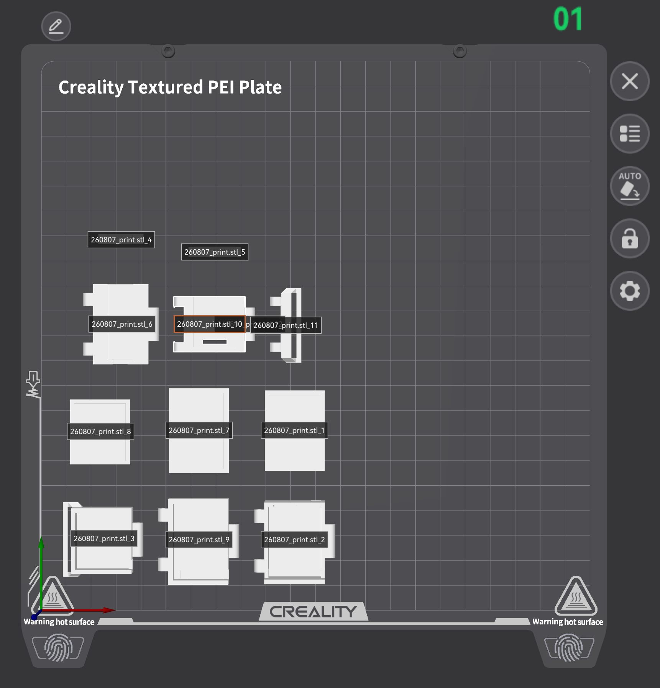

# GCDP Heat Risk Alert Wristband

Wearable safety-alert prototype developed for the 2025-2 Global CDP
Thailand-Korea program. The device measures pulse and skin temperature,
acquires GNSS coordinates, and sends an emergency SMS over LTE-M.



Latest housing revision prepared for printing on 2026-08-10.

## Prototype Hardware

- ESP32-C3 SuperMini controller
- M5Stack Stamp CatM S003 (SIM7080G) LTE-M/NB-IoT modem
- Beitian BE-220 GNSS module
- MAX30102 pulse/PPG sensor
- TMP117 temperature sensor
- 3 V active buzzer
- 3.7 V 220 mAh Li-Po battery
- Modular 3D-printed hinged housings

## Verified Prototype Functions

- Concurrent MAX30102 and TMP117 acquisition over I2C
- LTE network registration with an activated SKT-network SIM
- GNSS coordinate acquisition
- SMS transmission containing heart rate, temperature, and location
- Battery-powered operation of the integrated prototype
- Standalone buzzer-guided measurement workflow

## ESP32-C3 SuperMini Pin Map

| Function | GPIO |
| --- | ---: |
| I2C SDA (MAX30102/TMP117) | 8 |
| I2C SCL (MAX30102/TMP117) | 9 |
| Stamp CatM RX into ESP | 20 |
| Stamp CatM TX from ESP | 21 |
| BE-220 RX into ESP | 6 |
| BE-220 TX from ESP | 7 |
| Active buzzer | 10 |
| Test trigger | 4 |
| Battery-test input | 5 |

UART labels above are from the ESP32 perspective. Cross the physical UART
connections: module TX to ESP RX, and module RX to ESP TX. All modules must
share ground.

## Repository Layout

- `firmware/`: PlatformIO firmware and captured sensor/UART evidence
- `hardware/pcb/`: Altium schematic and PCB design history
- `hardware/enclosure/`: Fusion export, STEP/STL files, generators, and fit notes
- `docs/`: dated bring-up, integration, power, and module-selection records
- `media/cad/`: selected enclosure renders for quick review
- `evidence/`: dated hardware, 3D-printing, demo, screenshot, and 3D-scan records

For a chronological review of the engineering work, start with
[`evidence/README.md`](evidence/README.md), then read the dated logs in
[`docs/`](docs/). The repository intentionally excludes personal information,
administrative records, raw purchase documents, and generated build caches.

The redacted first-purchase request and supporting quotations are available at
[`docs/260812_GCDP_team5_procurement_request_public.pdf`](docs/260812_GCDP_team5_procurement_request_public.pdf).

Third-party datasheets, downloaded CAD models, raw presentation media,
original procurement files, personal identifiers, and generated build caches
are not tracked in this repository.

## Build and Upload

Open `firmware/` as a PlatformIO project, then run:

```powershell
pio run -e esp32c3_supermini
pio run -e esp32c3_supermini -t upload
pio device monitor -b 115200
```

Before field use, replace the placeholder `STANDALONE_ALERT_NUMBER` in
`firmware/include/pins.h` with the intended recipient number.

## Status

This repository documents a functional presentation prototype. It is not a
certified medical device, and measured values must not be used for diagnosis
or treatment decisions.
