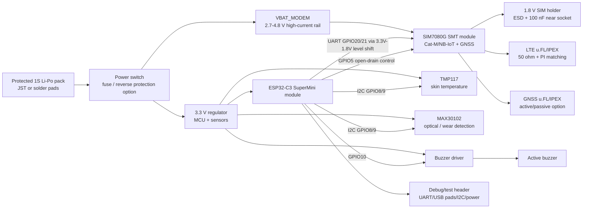

# GCDP Heat Risk Alert Wristband - 1st PCB Circuit Design Start

Date: 2026-07-09

Scope: 1차 PCB 회로 설계 시작 문서. 인수인계서, 기존 bring-up 로그, pre-PCB 회로 메모를 기준으로 누락 결정사항을 점검하고, 블록 다이어그램, 부품 후보, 전원 구조, ESP32-C3 SuperMini carrier pin map, schematic 작성 순서를 정리한다.

## 1. 설계 기준 요약

확정 기준:

- 1차 PCB는 완제품형 칩 통합 PCB가 아니라 검증된 모듈을 얹는 carrier board로 설계한다.
- MCU는 ESP32-C3 SuperMini 모듈을 그대로 탑재한다.
- MCU 칩 단위 통합은 1차 PCB에서 하지 않는다.
- GPS/GNSS는 반드시 포함한다.
- 통신 모듈은 PCB에 통합한다. 기존 SIM7080G developer kit는 최종 탑재 대상이 아니다.
- Li-Po 배터리를 사용한다.
- 1차 PCB에는 충전회로를 넣지 않는다.
- SMS 자동 발송은 계속 금지한다. 현재 정책은 manual serial command only.

검증 완료 기반:

- TMP117, MAX30102, I2C 동시 동작, buzzer GPIO, SIM7080G UART AT, SKT 등록, SMS 송신, SIM7080G GNSS 좌표 수신 확인 완료.
- 통신 모듈 전원 안정성과 antenna 연결은 1차 PCB 설계 핵심 리스크다.

## 2. 누락된 설계 결정사항 점검

| 항목 | 현재 판단 | 1차 PCB 결정 |
| --- | --- | --- |
| 통신/GNSS 모듈 | SIM7080G 계열에서 실제 SKT/SMS/GNSS 검증됨 | 1차 권장: SIM7080G bare SMT module |
| 통합형 vs 분리형 GNSS | 분리형은 부품/펌웨어/antenna가 늘어남 | 통신+GNSS 통합 모듈 우선 |
| SIM holder | bare SIM7080G는 외부 SIM socket 필요 | PCB에 nano/micro SIM holder 배치 |
| LTE antenna connector | developer kit에서 antenna 없이는 사실상 수신 불가 | u.FL/IPEX 계열 우선, 50 ohm RF + PI matching reserve |
| GNSS antenna connector | GNSS 필수, LTE와 별도 고려 필요 | u.FL/IPEX 계열 우선, active/passive 선택 전원 옵션 reserve |
| Li-Po 전원 rail | SIM7080G VBAT 범위가 Li-Po 직접 연결 가능 범위와 겹침 | Li-Po -> protected/switched VBAT_MODEM 직접 공급안 우선 |
| 3.3 V rail | SuperMini/센서용 안정 rail 필요 | Li-Po -> 3.3 V regulator, modem rail과 분리 |
| 5 V boost | SIM7080G bare module에는 필수 아님 | 기본 미사용. SuperMini 5V pin 사용 여부는 조립 옵션으로만 |
| PWRKEY | devkit 동작 복사 금지 | SIM7080G datasheet 기준, open-drain low-side pull-down |
| UART level | SIM7080G UART는 1.8 V domain | ESP32-C3 3.3 V UART와 level shifter 필요 |
| Buzzer driver | buzzer 전류 미확정 | transistor low-side driver 기본 적용 |
| Sensor placement | 회로보다 기구 영향 큼 | MAX30102/TMP117은 skin-side edge/별도 sensor island 고려 |
| Debug/test | PCB bring-up 필수 | UART, I2C, 3V3, VBAT_MODEM, PWRKEY, STATUS, RF option test points |

## 3. 통신/GNSS 모듈 후보

### 3.1 1차 권장: SIMCom SIM7080G bare SMT module

선정 이유:

- 이미 SIM7080G 계열 developer kit로 SKT 등록, SMS 송신, GNSS 좌표 수신을 확인했다.
- SIMCom 공식 제품 정보 기준 SIM7080G는 CAT-M/NB-IoT SMT 모듈이며 GNSS 옵션을 제공한다.
- 크기는 약 17.6 mm x 15.7 mm x 2.3 mm로 1차 wristband carrier PCB에 현실적인 편이다.
- 공급 전압 범위는 2.7 V to 4.8 V라 1-cell Li-Po 전압 범위와 직접 연결 가능하다.
- hardware design 문서 기준 CAT-M/NB-IoT emission peak current는 0.5 A 수준을 고려해야 한다.

주의:

- SIM7080G UART/GPIO는 1.8 V domain이다. ESP32-C3 3.3 V와 직접 연결하지 말고 level shifter 또는 reference transistor circuit을 넣는다.
- SIM card는 1.8 V SIM만 지원한다고 문서에 명시되어 있으므로 SIM holder/USIM 호환성을 확인한다.
- PWRKEY는 내부 1.8 V pull-up이 있으며, 1초 이상 low pulse로 power-on, 1.2초 이상 low pulse로 power-off한다. 상시 GND short 금지.
- RF_ANT와 GNSS_ANT가 별도 pad로 존재하므로 LTE/GNSS antenna connector를 분리한다.

### 3.2 대안 A: Quectel BG77/BG770A-GL 계열

장점:

- SIM7080G보다 더 작은 초소형 LPWA + GNSS 계열로 wristband 최종형에는 매력적이다.
- LTE Cat M1/NB-IoT와 GNSS 통합 방향성은 프로젝트 요구와 맞다.

리스크:

- 현재 firmware, AT command path, SKT/SMS/GNSS 검증은 SIM7080G 기준이다.
- 1차 PCB에서 모듈을 바꾸면 bring-up 리스크가 커진다.
- SIM/PWRKEY/PON_TRIG/power sequencing이 SIM7080G와 다르므로 reference circuit 재검토가 필요하다.

### 3.3 대안 B: M5Stamp CAT-M S003 + 별도 GNSS

판단:

- S003은 작지만 GNSS가 없어 단독 사용 불가다.
- 별도 GNSS 모듈을 추가하면 antenna, UART/I2C, 전원, firmware integration이 늘어난다.
- 1차 PCB 회로 단순성 관점에서는 권장하지 않는다.

결론:

```text
1차 PCB schematic 초안은 SIM7080G bare SMT module 기준으로 시작한다.
BG77/BG770A 계열은 2차 소형화 후보로 남긴다.
```

## 4. 1차 PCB 블록 다이어그램



## 5. 전원 구조 초안

### 5.1 권장 power tree

```text
Protected 1S Li-Po pack
  -> main power switch / removable jumper
  -> VBAT_RAW
      -> VBAT_MODEM: SIM7080G VBAT pins, short/wide trace, bulk caps near module
      -> 3V3_REG: ESP32-C3 SuperMini 3V3 pin, TMP117, MAX30102, buzzer logic
```

### 5.2 SIM7080G VBAT rail

설계값:

- Nominal: 3.7 V Li-Po
- Full: 4.2 V
- SIM7080G allowed: 2.7 V to 4.8 V
- Peak design current: at least 0.5 A, margin 포함해서 regulator/protection/trace는 1 A급 이상으로 설계

회로:

- VBAT pins 34/35는 반드시 함께 연결한다.
- VBAT_MODEM trace는 짧고 넓게. 1차 PCB에서는 최소 1 mm 이상, 가능하면 2 mm급 polygon/plane 사용.
- 모듈 VBAT pin 근처에 bulk + MLCC를 배치한다.
- 초기 schematic capacitor reserve:
  - 100 uF low-ESR bulk x 2 or x 3 near SIM7080G VBAT
  - 10 uF
  - 1 uF
  - 100 nF
  - TVS diode near VBAT pins
- 정상 동작 중 VBAT를 강제로 끊는 설계는 피한다. power-off는 AT+CPOWD=1 또는 PWRKEY 절차를 우선한다.

### 5.3 3.3 V rail

용도:

- ESP32-C3 SuperMini 3V3 input
- TMP117
- MAX30102
- buzzer driver input side
- level shifter MCU side

요구:

- modem current spike가 3.3 V rail에 직접 흔들림을 주지 않게 VBAT_MODEM과 decoupling/return path를 분리한다.
- SuperMini의 5V pin으로 공급할지 3V3 pin으로 공급할지는 모듈 상세 회로 확인 후 freeze한다. 1차 schematic에는 3V3 regulated input을 기본으로 잡고, 필요시 5V boost option footprint를 DNP로 남긴다.

### 5.4 배터리/보호

1차 PCB에는 충전회로를 넣지 않는다.

필수 조건:

- protected Li-Po pack 사용을 BOM/조립 지시서에 명시한다.
- PCB 입력단에 power switch 또는 removable jumper를 둔다.
- fuse/polyfuse 또는 0 ohm shunt footprint를 둬 bring-up 시 current measurement 가능하게 한다.
- reverse protection은 connector 실수 가능성이 있으면 ideal diode/load switch 또는 series protection footprint를 둔다.

## 6. ESP32-C3 SuperMini carrier pin map

SuperMini 기준 최종 draft:

| Function | ESP32-C3 SuperMini pin | Net | 비고 |
| --- | --- | --- | --- |
| I2C SDA | GPIO8 | I2C_SDA_3V3 | SuperMini pinout의 SDA. firmware `esp32c3_supermini` env와 일치 |
| I2C SCL | GPIO9 | I2C_SCL_3V3 | SuperMini pinout의 SCL |
| LTE UART RX | GPIO20 | LTE_TXD_TO_MCU_1V8 via level shift | modem TXD -> MCU RX |
| LTE UART TX | GPIO21 | LTE_RXD_FROM_MCU_1V8 via level shift | MCU TX -> modem RXD |
| LTE PWRKEY control | GPIO5 | LTE_PWRKEY_CTL | N-MOS/NPN open-drain low-side |
| Buzzer PWM/ON | GPIO10 | BUZZER_CTL | transistor driver 권장 |
| Optional status input | GPIO4 or GPIO3 | LTE_STATUS_1V8 via level shift | SIM7080G STATUS 읽기 옵션 |
| Optional modem DTR | GPIO2 | LTE_DTR_1V8 via level shift | sleep mode 제어 옵션, 초기 DNP 가능 |
| Boot/USB native | module USB-C | programming/debug | SuperMini 자체 USB-C 유지 |

주의:

- XIAO bring-up 로그의 GPIO6/GPIO7 I2C는 검증 이력으로만 본다. 1차 PCB는 SuperMini 탑재가 확정이므로 GPIO8/GPIO9를 I2C 기본으로 사용한다.
- GPIO20/21은 현재 integrated firmware의 SuperMini env와 일치하게 유지한다.
- modem UART는 1.8 V라 level shifting이 필요하다. devkit UART 핀이 3.3 V tolerant처럼 동작했던 경험을 bare module에 적용하지 않는다.

## 7. 센서 회로 초안

### 7.1 I2C common bus

```text
3V3_REG
  -> 4.7 k pull-up to I2C_SDA_3V3
  -> 4.7 k pull-up to I2C_SCL_3V3
ESP32-C3 GPIO8/GPIO9
  -> TMP117
  -> MAX30102
```

초기값:

- Pull-up: 4.7 k to 3.3 V
- Test point: SDA, SCL, 3V3, GND
- Address:
  - TMP117: 0x48
  - MAX30102: 0x57

### 7.2 TMP117

- VIN -> 3V3_REG
- GND -> GND
- SDA/SCL -> I2C bus
- ADDR -> default 0x48. 필요시 solder jumper option reserve.
- INT -> test pad 또는 MCU spare pin option, 초기 DNP.
- 기구: skin-side thermal contact가 중요하다. LTE/modem/regulator 발열과 분리한다.

### 7.3 MAX30102

- VIN -> 3V3_REG
- GND -> GND
- SDA/SCL -> I2C bus
- INT -> test pad 또는 MCU spare pin option, 초기 DNP 가능.
- 기구: optical window, 차광, 피부 압력, sensor height가 성능을 좌우한다. 1차 PCB에서는 sensor를 board underside 또는 edge island에 배치하는 안을 우선 검토한다.

## 8. SIM7080G 회로 초안

필수 nets:

```text
VBAT_MODEM
GND
PWRKEY
STATUS optional
UART1_TXD / UART1_RXD
SIM_VDD / SIM_DATA / SIM_CLK / SIM_RST / SIM_DET optional
RF_ANT
GNSS_ANT
USB_DP / USB_DM / USB_VBUS test pads optional
BOOT_CFG test pad, keep open for normal boot
VDD_EXT test pad
```

PWRKEY:

- MCU GPIO5 -> gate/base drive -> N-MOS/NPN low-side pull-down.
- PWRKEY external pull-up 없음.
- Power-on pulse: 1.0 s 이상, 12.6 s 미만.
- Power-off pulse: 1.2 s 이상 또는 AT+CPOWD=1.
- PWRKEY를 GND에 영구 short하지 않는다.

UART level shift:

- ESP32-C3 3.3 V UART <-> SIM7080G 1.8 V UART.
- TX/RX 모두 level shifter 적용.
- 초기 회로는 2-channel auto-direction level translator보다 unidirectional UART용 translator 또는 reference BJT circuit을 우선 검토한다.

SIM holder:

- 1.8 V SIM 기준.
- SIM socket은 module 가까이 배치한다.
- SIM_VDD에 100 nF capacitor를 socket 가까이에 둔다.
- SIM_CLK는 짧고 GND guard 우선. branch 금지.
- SIM line ESD diode는 low-capacitance type.

## 9. Antenna / RF 배치 결정

1차 결정:

- LTE antenna connector: u.FL/IPEX.
- GNSS antenna connector: u.FL/IPEX.
- LTE RF_ANT와 GNSS_ANT는 별도 connector와 별도 50 ohm trace.
- 각 RF path에 PI matching network reserve:
  - series 0 ohm default
  - shunt C/L footprints DNP
- RF ESD TVS는 low capacitance 부품 footprint reserve.

배치 원칙:

- RF trace는 짧게, 50 ohm controlled impedance.
- right angle 금지, GND via fence 사용.
- LTE antenna와 GNSS antenna는 가능한 멀리 배치한다.
- SIM7080G hardware design checklist 기준 LTE main antenna와 GNSS antenna decoupling 목표는 30 dB 이상이다.
- GNSS active antenna를 쓸 가능성이 있으므로 GNSS antenna bias supply option footprint를 둔다. passive antenna만 쓸 경우 external LNA 필요성이 생기므로 1차 bring-up은 active GNSS antenna option을 더 현실적으로 본다.

## 10. Buzzer 회로 초안

권장:

```text
GPIO10 -> base/gate resistor -> N-MOS or NPN low-side switch -> active buzzer -> 3V3 or VBAT
```

- Active buzzer 사용.
- buzzer 정격 전류 확인 전까지 GPIO direct drive는 최종 schematic에서 피한다.
- magnetic buzzer라면 flyback diode 또는 적절한 clamp를 고려한다.
- Test point: BUZZER_CTL.

## 11. Debug / test point

필수 test points:

- GND multiple
- VBAT_RAW
- VBAT_MODEM near modem
- 3V3_REG
- I2C_SDA, I2C_SCL
- LTE_TXD_1V8, LTE_RXD_1V8
- MCU_UART_RX/TX 3.3 V side
- PWRKEY
- STATUS
- VDD_EXT
- BOOT_CFG, keep open
- SIM_VDD
- GNSS antenna bias rail if used

Debug connector:

- 1x6 or pads:
  - GND
  - 3V3
  - MCU TX
  - MCU RX
  - I2C SDA
  - I2C SCL
- SuperMini USB-C는 firmware upload/debug용으로 접근 가능해야 한다.

## 12. Schematic 작성 순서

1. Sheet 1: Title / system notes / design constraints
2. Sheet 2: Battery input, switch, protection, current-measure jumper
3. Sheet 3: 3.3 V regulator and decoupling
4. Sheet 4: ESP32-C3 SuperMini carrier footprint and headers
5. Sheet 5: SIM7080G module, VBAT bulk caps, PWRKEY, STATUS, UART level shift
6. Sheet 6: SIM holder and SIM ESD
7. Sheet 7: LTE antenna, GNSS antenna, matching networks, GNSS bias option
8. Sheet 8: TMP117 and MAX30102 I2C sensors
9. Sheet 9: Buzzer driver
10. Sheet 10: Test points and debug connector
11. ERC pass: power flags, level domains, no-connect pins, SIM/RF warnings 확인
12. Pre-layout checklist: power trace width, RF keepout, sensor placement, antenna separation, SuperMini USB access

## 13. Schematic freeze 전 확인 필요

부품/구매 확인:

- SIM7080G bare module 실제 구매처와 exact variant 확인.
- 1.8 V SIM이 현재 SKT physical SIM과 호환되는지 확인.
- u.FL/IPEX connector footprint와 antenna cable/antenna 확보.
- active GNSS antenna를 쓸지 passive GNSS antenna + LNA를 쓸지 결정.
- 3.3 V regulator part number와 peak/load 조건 확인.
- Li-Po pack 보호회로 내장 여부 확인.
- buzzer 정격 전류 확인.

전기 확인:

- SuperMini에 3V3 pin 직접 공급 시 onboard regulator/USB 연결과 충돌이 없는지 확인.
- SIM7080G UART level shifter 회로를 reference design 기준으로 확정.
- PWRKEY pulse 회로를 SPICE까지는 아니어도 logic-level 관점에서 검토.
- LTE attach/SMS/GNSS 중 VBAT_MODEM droop를 측정할 수 있도록 current shunt/test pads 준비.

기구 확인:

- MAX30102 optical window 위치.
- TMP117 thermal contact 위치.
- LTE/GNSS antenna 위치와 wrist 착용 시 인체/배터리/ground 영향.
- SIM holder 접근성.
- Li-Po 배터리 위치와 교체/충전 방식.

## 14. 사용한 외부 reference

- SIMCom SIM7080G official product page: https://www.simcom.com/product/SIM7080G.html
- SIM7080G Hardware Design V1.04 PDF: https://edworks.co.kr/wp-content/uploads/2022/04/SIM7080G_Hardware_Design_V1.04.pdf
- Quectel BG95 Series Hardware Design V1.5 PDF: https://images.quectel.com/python/2023/04/Quectel_BG95_Series_Hardware_Design_V1.5.pdf
- Quectel BG77 Hardware Design V1.3 PDF: https://images.quectel.com/python/2023/04/Quectel_BG77_Hardware_Design_V1.3.pdf
- Quectel BG770A-GL product/spec reference: https://static6.arrow.com/aropdfconversion/57cf8525af9901a4e073efe507a9298412b7cf4a/quectelbg770a-gl.pdf

## 15. 현재 회로 설계 결정 한 줄 버전

```text
1차 PCB는 ESP32-C3 SuperMini + SIM7080G bare SMT module + PCB SIM holder + LTE/GNSS u.FL antenna + Li-Po direct modem rail + separate 3.3 V rail 구조로 schematic 초안을 시작한다.
```
